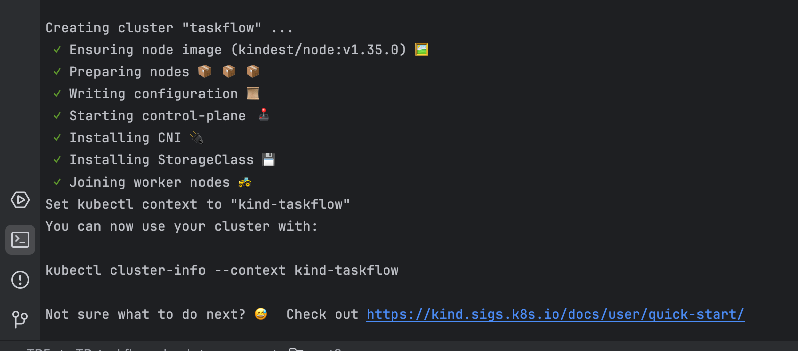
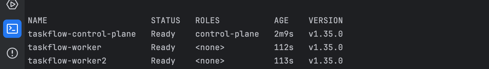
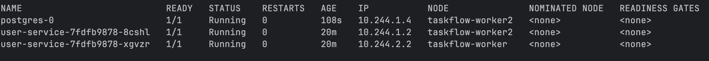
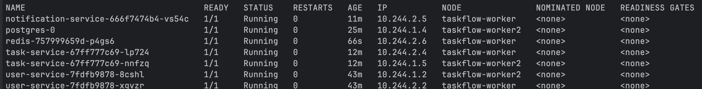

# Rapport TP Partie 3 - Kubernetes

## Partie 1 - Monter la stack avec K8S

### Etape 1 - Creer le cluster kind multi-noeuds

Commandes utilisees :

```bash
kind create cluster --name taskflow --config k8s/kind-config.yaml
kubectl get nodes
kubectl create namespace staging
```

Observations :
- 3 nodes sont créés
- Il y a 1 qui a pour rôle control-plane et 2 type 'worker' qui apparaisse en NONE
- Les noms sont incrémentés en cas de node identique
- Chacun des nodes est "READY"







### Etape 2 - Ouvrir les terminaux d'observation

Observations :
 Il n'y avait rien à ce moment 

### Etape 3 - Deployer le user-service

Observations :
Dans une première étape j'ai eu une erreur d'image car je n'avais publié aucune image sur le dockerHub. 
Après un fix sur le repo github, j'ai pu récupérer les images via la commande. 


### Etape 4 - Deployer PostgreSQL

Observations :
Nous avons donc ajouter un nouveau service sur le worker 2: postgres mais avec une IP différente.

> Quelle propriété du StatefulSet garantit que chaque Pod conserve toujours le même volume de stockage, même après un redémarrage ou un rescheduling sur un autre nœud ?

La propriété importante est volumeClaimTemplates.
Dans un StatefulSet, chaque Pod reçoit une identité stable, par exemple postgres-0.
Même si le Pod redémarre ou est déplacé sur un autre nœud, il garde le même nom et récupère donc le même volume persistant.


>Pourquoi un Deployment serait-il inadapté pour PostgreSQL, même si techniquement on peut lui attacher un volume ?

  On risque d'augmenter les incohérences et perdre la main sur l'ordre d'éxécution de transaction sur la BDD dû à une conccurence d'accès à ces BDDs. 


>Parmi les services restants de la stack TaskFlow (Redis, notification-service, api-gateway, frontend), lequel mériterait potentiellement un StatefulSet plutôt qu'un Deployment en production ? Justifiez votre choix.

Redis peut être amener à circuler des informations importantes. En prod, il est donc intéressant de ne pas créer de la confusion dans ce service.




### Etape 5 - Deployer Notif Service et task service


>Comment ce service consomme-t-il les événements Redis ?

Le service de notification lit les événements publiés par Redis afin de les utiliser.

>Qu'est-ce que cela implique sur le nombre de replicas à choisir ? Pour quel(s) service(s) ?

Peu importe le nombre de service de notification que l'on déploit, tous écouterons la même instance de Redis. On risque donc d'être amené à plusieurs traitements identiques pour un même message. 
En conséquence il est plus intéressant de  n'avoir qu'un seul réplica du service de notification (car il dépend d'un état).


### Etape 6 - Deployer Redis

Commandes utilisees :

```bash
kubectl apply -f k8s/base/redis/
kubectl get pods -n staging -o wide
```

Observations :

Redis est deploye avec un Deployment et un seul replica. Dans ce TP, Redis sert de bus de messages entre `task-service` et `notification-service`.
La perte des messages Redis au redemarrage est acceptable en environnement de staging, donc un volume persistant n'est pas necessaire ici.

Contrairement aux services HTTP, Redis ne fournit pas de route `/health`. La readiness probe utilise donc la commande `redis-cli ping`, qui permet de verifier que Redis accepte bien les connexions.



### Etape 7 - Deployer api-gateway et frontend

Commandes utilisees :

```bash
kubectl apply -f k8s/base/api-gateway/
kubectl apply -f k8s/base/frontend/
kubectl get pods -n staging -o wide
```


Choix des replicas :

- `api-gateway` : 2 replicas. C'est un service stateless qui route les requetes vers les services internes. Plusieurs replicas permettent de mieux repartir les requetes et de garder un minimum de disponibilite si un Pod tombe.
- `frontend` : 2 replicas. Le frontend sert des fichiers statiques via nginx. Il ne conserve pas d'etat partage entre les requetes, donc il peut etre replique facilement.

Choix des ressources :

- `api-gateway` execute du code Node.js a chaque requete et fait du proxy vers les services internes. Il a donc des ressources proches des autres services applicatifs.
- `frontend` sert principalement des fichiers precompiles. Il demande moins de CPU et de memoire que les services Node.js.

Impact d'une indisponibilite :

- Si `api-gateway` est indisponible, le frontend ne peut plus communiquer avec l'API.
- Si `frontend` est indisponible, l'utilisateur ne peut plus acceder a l'interface web, meme si les services backend fonctionnent encore.

### Etape 8 - Verifier que tout tourne

Commandes utilisees :

```bash
kubectl get all -n staging
kubectl logs -n staging deployment/task-service
kubectl logs -n staging deployment/user-service
kubectl logs -n staging deployment/notification-service
kubectl logs -n staging deployment/api-gateway
```

Observations :

- Tous les Pods doivent etre en `1/1 Running`.
- Les Services doivent etre presents pour `postgres`, `redis`, `user-service`, `task-service`, `notification-service`, `api-gateway` et `frontend`.
- Les Deployments doivent avoir le nombre de replicas attendu.
- Le StatefulSet PostgreSQL doit afficher un Pod stable, generalement `postgres-0`.


