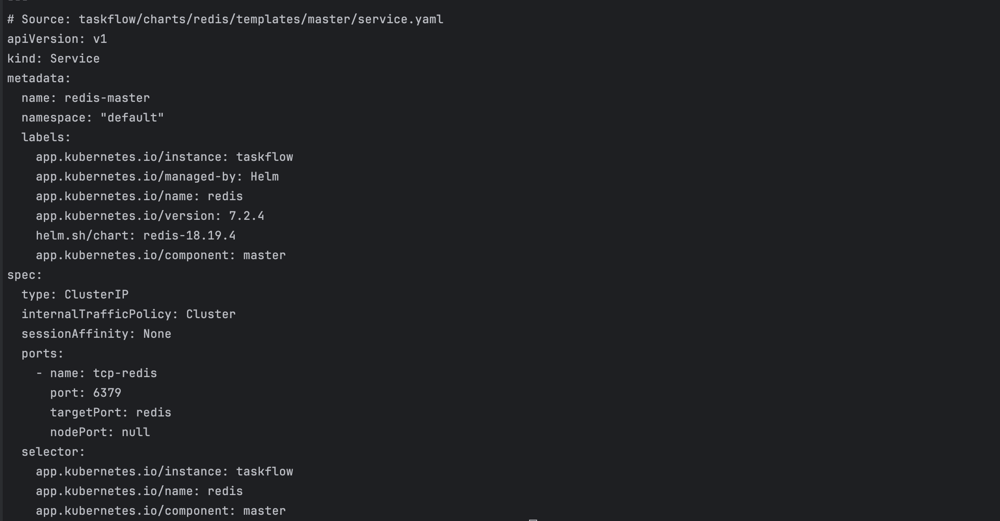
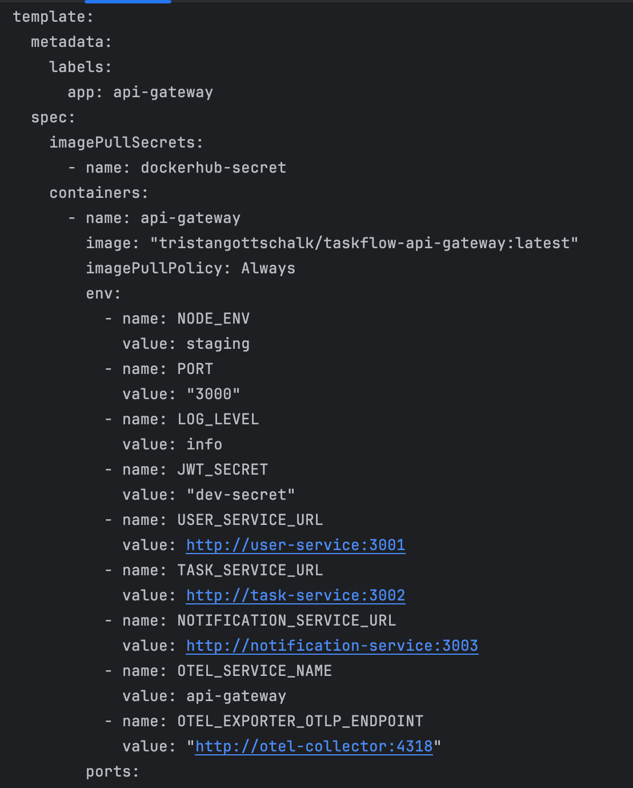
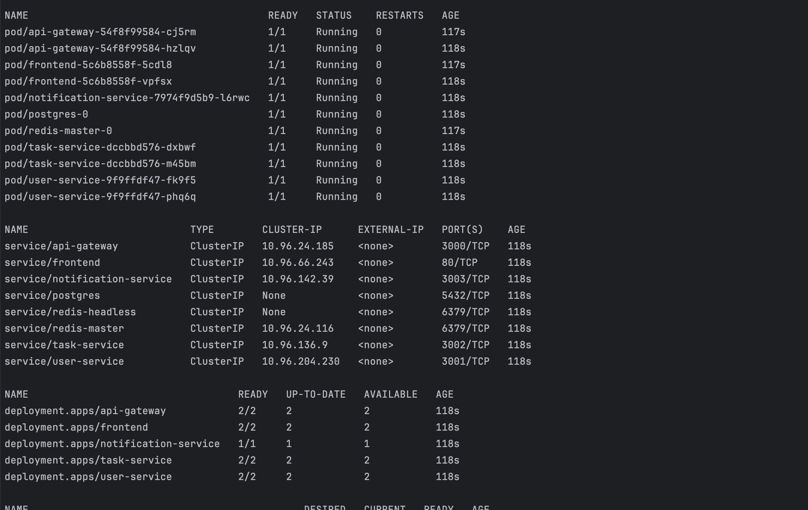
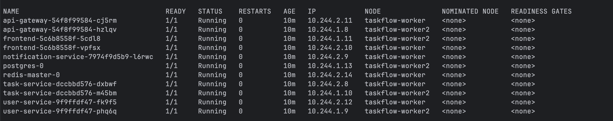
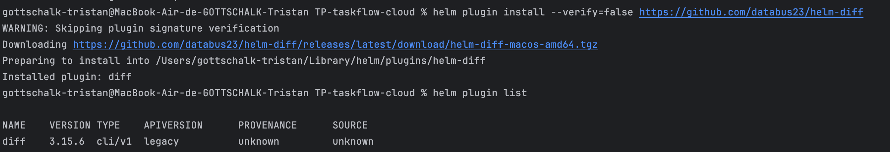
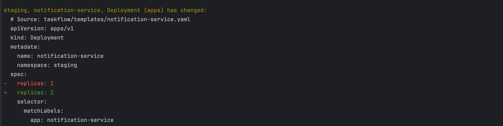
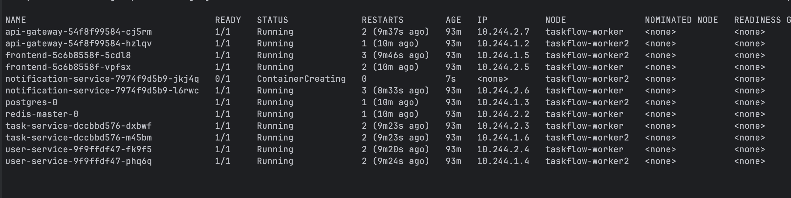
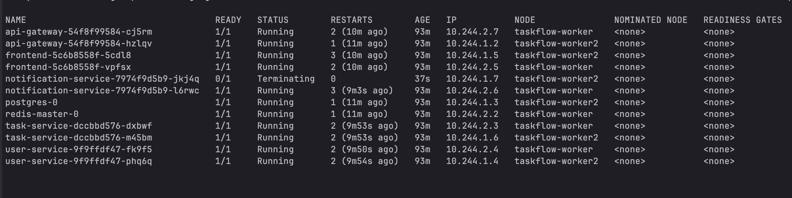

# Pré-requis

> 1. Comment Helm résout-il le problème de répétition vu dans la dernière partie du TP (cf. dernière question théorique de la partie précédente) ? Quel fichier joue le rôle central dans un chart Helm ?
 
Helm permet de factoriser les multiples fichiers grâce à 3 fichiers-concept : 
- Chart (regroupe l'infra globalement & ses métadonnées)
- Values (regroupe les valeurs qui seront utilisées par chaque mapConfig)
- Template (regroupe tous les services et ceux dont ils ont besoin en 1 fichier)

> 2. À partir de quel niveau de complexité (nombre de services, nombre d'environnements) estimez-vous que Helm devient indispensable plutôt que simplement utile ? Justifiez.

Plus que le nombre de service, c'est lorsque l'ordre d'éxécution des services devient important qu'helm apporte un grand plus. Le refactor n'est qu'un bonus.
Bien entendu on peut imaginer qu'à partir de 3-5 services cela peut déjà devenir très pénible d'écrire 3 fichiers par service.

## Partie A - Application TaskFlow

### Etape 1 - Creer le chart de TaskFlow

Objectif de cette etape :

- transformer les manifests Kubernetes ecrits a la main en templates Helm ;
- centraliser les valeurs repetitives dans `values.yaml` ;
- deleguer Redis a un sous-chart maintenu par Bitnami.

### Templates ajoutes

Les templates suivants ont ete ajoutes dans `helm/taskflow/templates/` :

- `task-service.yaml`
- `notification-service.yaml`
- `api-gateway.yaml`
- `frontend.yaml`
- `ingress.yaml`

Chaque template reprend la structure des manifests Kubernetes de la partie precedente, mais les valeurs variables sont remplacees par des expressions Helm.

Par exemple :

```yaml
replicas: {{ .Values.taskService.replicaCount }}
```

Ici, Helm remplace `{{ .Values.taskService.replicaCount }}` par la valeur definie dans `values.yaml`.
Cela permet de changer le nombre de replicas sans modifier directement le template Kubernetes.

Autre exemple :

```yaml
image: "{{ .Values.image.prefix }}-task-service:{{ .Values.taskService.tag }}"
```

Cette ligne reconstruit le nom complet de l'image Docker a partir de deux valeurs :

- `image.prefix`, commun a tous les services ;
- `taskService.tag`, specifique au `task-service`.

Helm sert donc a separer :

- la structure Kubernetes, dans `templates/` ;
- les valeurs configurables, dans `values.yaml`.

### Completion du values.yaml

Le fichier `helm/taskflow/values.yaml` a ete complete avec les blocs manquants :

- `frontend`
- `taskService`
- `notificationService`
- `apiGateway`

J'ai aussi corrige le prefix Docker Hub :

```yaml
image:
  prefix: tristangottschalk/taskflow
```

Cela permet de generer des images comme :

```text
tristangottschalk/taskflow-api-gateway:latest
tristangottschalk/taskflow-task-service:latest
tristangottschalk/taskflow-frontend:latest
```

### Correction du template user-service

Le template `user-service.yaml` utilisait :

```yaml
{{ .Values.image.tag }}
```

Mais cette valeur n'existait pas dans `values.yaml`. Le chart aurait donc genere une image incomplete ou incorrecte.

Le template utilise maintenant :

```yaml
{{ .Values.userService.tag }}
```

Cela rend le comportement coherent avec les autres services : chaque service peut avoir son propre tag d'image.

### Redis en sous-chart Bitnami

Redis n'est pas conserve comme template maison dans cette partie. A la place, il est declare comme dependance dans `helm/taskflow/Chart.yaml` :

```yaml
dependencies:
  - name: redis
    version: "18.x.x"
    repository: "https://charts.bitnami.com/bitnami"
    condition: redis.enabled
```

Le champ `dependencies` indique a Helm que le chart TaskFlow depend d'un autre chart.
Ici, le chart Redis vient du repository Bitnami.

Le champ :

```yaml
condition: redis.enabled
```

permet d'activer ou desactiver Redis depuis `values.yaml` :

```yaml
redis:
  enabled: true
```

### Pourquoi REDIS_URL pointe vers redis-master

Dans le chart Bitnami Redis 18.x, le Service du master s'appelle :

```text
redis-master
```

C'est pour cela que les services applicatifs Helm utilisent maintenant :

```yaml
REDIS_URL=redis://redis-master:6379
```

Dans les manifests Kubernetes faits a la main, le Service s'appelait simplement `redis`.
Avec le sous-chart Bitnami, ce nom change, donc les variables d'environnement doivent suivre.



### Commande a lancer

La dependance Redis est declaree dans `Chart.yaml`, mais elle n'est pas encore telechargee dans le dossier du chart.

La commande a lancer est :

```bash
helm dependency update ./helm/taskflow
```

Cette commande lit les dependances dans `Chart.yaml`, telecharge les sous-charts manquants et les place dans :

```text
helm/taskflow/charts/
```

Avant cette commande, Helm indique que Redis est manquant :

```text
NAME    VERSION   REPOSITORY                         STATUS
redis   18.x.x    https://charts.bitnami.com/bitnami missing
```

Apres la commande, le chart Redis sera disponible localement et Helm pourra generer le YAML complet de l'application TaskFlow, y compris Redis.

### Verification du Service Redis

La commande suivante permet de verifier uniquement le Service Redis genere par le sous-chart :

```bash
helm template taskflow ./helm/taskflow \
  --values ./helm/taskflow/values.yaml \
  --show-only charts/redis/templates/master/service.yaml
```

Le Service attendu s'appelle :

```text
redis-master
```

Ce nom vient du chart Bitnami Redis. Meme avec :

```yaml
fullnameOverride: redis
```

le Service du master garde le suffixe `-master`. Les variables `REDIS_URL` des services applicatifs doivent donc pointer vers :

```text
redis://redis-master:6379
```

### Reflexion theorique - Redis et PostgreSQL

> En vous appuyant sur le critère vu en cours, justifiez pourquoi Redis se prête à un chart officiel.

Redis se prete bien a un chart officiel car c'est un composant generique, reutilisable et tres standardise. Son besoin ne depend pas fortement du code TaskFlow : il faut surtout un Deployment/StatefulSet selon le mode choisi, un Service, des probes, des ressources et eventuellement de la persistance ou de l'authentification.

Utiliser le chart Bitnami permet de profiter d'une configuration maintenue, testee, documentee et deja prevue pour plusieurs cas d'usage. Cela evite de maintenir nous-memes toute la complexite Redis alors que notre valeur ajoutee est plutot dans les services TaskFlow.

> Pourquoi a-t-on conservé un template maison pour PostgreSQL plutôt que d'utiliser `bitnami/postgresql` ?

PostgreSQL est reste en template maison car notre configuration actuelle contient deja des choix tres specifiques au TP.

Deux elements rendraient la migration vers Bitnami plus couteuse :

- L'initialisation de la base avec notre script SQL `init.sql`, qui cree les tables `users`, `tasks`, `notifications` et insere des donnees de test.
- Le schema de variables et de connexion deja utilise par les services (`postgres-secret`, `POSTGRES_USER`, `POSTGRES_PASSWORD`, `POSTGRES_DB`, Service `postgres`, URL `postgresql://...@postgres:5432/...`).

Migrer vers `bitnami/postgresql` obligerait a verifier les noms de Services, les Secrets generes, les cles attendues, la gestion de l'initialisation SQL et la compatibilite avec les URLs deja utilisees dans les services. Pour un TP, garder un template maison reste donc plus lisible.

## Etape 2 - Values par environnement

### Sortie des valeurs sensibles

Les valeurs sensibles ne doivent pas etre versionnees dans Git, meme dans un depot prive. J'ai donc sorti les secrets des fichiers commites.

Les fichiers versionnes contiennent uniquement la structure attendue :

```yaml
secrets:
  postgresPassword: ""
  jwtSecret: ""
```

Le vrai fichier utilise localement est :

```text
helm/taskflow/values.secret.yaml
```

Il est ignore par Git via `.gitignore`, et un exemple sans vrai secret est fourni :

```text
helm/taskflow/values.secret.example.yaml
```

Pour deployer ou generer les manifests, il faut donc passer deux fichiers de valeurs :

```bash
helm template taskflow ./helm/taskflow \
  --values ./helm/taskflow/values.yaml \
  --values ./helm/taskflow/values.secret.yaml
```

ou :

```bash
helm upgrade --install taskflow ./helm/taskflow \
  --namespace staging \
  --values ./helm/taskflow/values.yaml \
  --values ./helm/taskflow/values.secret.yaml
```

Les templates utilisent maintenant `required`. Si `values.secret.yaml` n'est pas fourni, Helm echoue avec un message explicite, par exemple :

```text
secrets.jwtSecret is required. Provide it with --values ./helm/taskflow/values.secret.yaml
```



### Reflexion theorique - Secrets

> Comment déployer avec des valeurs sensibles sans les commiter ?

On peut deployer avec des valeurs sensibles en les placant dans un fichier local non versionne, ici `values.secret.yaml`, puis en le passant a Helm au moment du rendu ou de l'installation.

Le fichier est ajoute au `.gitignore`, ce qui evite de le commiter par erreur.

La commande combine alors les valeurs publiques et les valeurs privees :

```bash
helm upgrade --install taskflow ./helm/taskflow \
  --namespace staging \
  --values ./helm/taskflow/values.yaml \
  --values ./helm/taskflow/values.secret.yaml
```

> Pourquoi cette solution est-elle plus sûre que de mettre les valeurs dans `values.production.yaml`, même dans un dépôt privé ?

Un depot prive reste un endroit partage et durable. Plusieurs personnes, outils CI/CD, sauvegardes ou integrations peuvent y acceder. Si un secret est committe, il reste aussi dans l'historique Git, meme apres suppression du fichier.

Avec `values.secret.yaml`, le secret reste hors Git. Il peut etre gere localement, transmis par un coffre-fort, une variable CI/CD ou un outil dedie. Cela reduit le risque de fuite et evite de stocker les secrets dans l'historique du projet.

> Quel problème résout `helm-secrets` que cette solution ne résout pas ?

Notre solution evite de commiter les secrets, mais elle ne resout pas le partage securise de ces secrets entre plusieurs developpeurs ou environnements. Chaque personne ou pipeline doit disposer du fichier secret par un autre moyen.

`helm-secrets` permet de commiter un fichier de valeurs chiffre. Le fichier peut donc etre versionne, relu, audite et partage dans Git sans exposer son contenu en clair. Il est dechiffre uniquement au moment du deploiement.

Ce plugin devient utile dans une equipe ou en production, quand plusieurs personnes ou pipelines doivent deployer les memes secrets sans les faire circuler en clair.

> Dans GitHub Actions, comment passer `$POSTGRES_PASSWORD` dans `helm upgrade` sans l'afficher en clair dans les logs ?

Dans GitHub Actions, le mot de passe doit etre stocke dans les `Secrets` du repository ou de l'organisation, par exemple `POSTGRES_PASSWORD`.

On peut ensuite l'injecter dans Helm avec `--set-string`, en laissant GitHub masquer la valeur dans les logs :

```bash
helm upgrade --install taskflow ./helm/taskflow \
  --namespace staging \
  --values ./helm/taskflow/values.yaml \
  --set-string secrets.postgresPassword="${POSTGRES_PASSWORD}" \
  --set-string secrets.jwtSecret="${JWT_SECRET}"
```





## Etape 3 - Installation du chart

### Rendu Helm avant installation

Avant d'installer le chart, il faut generer le YAML final pour verifier ce que Helm va envoyer a Kubernetes.

Commande pour rendre tout le chart :

```bash
helm template taskflow ./helm/taskflow \
  --values ./helm/taskflow/values.yaml \
  --values ./helm/taskflow/values.secret.yaml
```

Commande pour filtrer uniquement le template du `task-service` :

```bash
helm template taskflow ./helm/taskflow \
  --values ./helm/taskflow/values.yaml \
  --values ./helm/taskflow/values.secret.yaml \
  --show-only templates/task-service.yaml
```

### Reflexion theorique - Variables Helm

> Que se passe-t-il si une variable référencée dans un template n'a pas de valeur correspondante dans `values.yaml` ?

Par defaut, si une valeur n'existe pas, Helm peut rendre une valeur vide ou `<no value>`, ce qui produit parfois un YAML invalide ou une configuration applicative cassee.

Dans notre chart, les valeurs sensibles utilisent la fonction Helm `required`. Cela force Helm a echouer si la valeur n'est pas fournie.

Exemple observe en rendant le chart sans `values.secret.yaml` :

```text
Error: execution error at (taskflow/templates/user-service.yaml:30:24):
secrets.jwtSecret is required. Provide it with --values ./helm/taskflow/values.secret.yaml
```

C'est mieux qu'un deploiement silencieusement incorrect, car l'erreur arrive avant l'installation.

> Comparez la sortie de `helm template` sur `task-service` avec `k8s/base/task-service/deployment.yaml`. Quelles différences structurelles observez-vous ? Pourquoi existent-elles ?

La sortie de `helm template` contient toujours du YAML Kubernetes classique. Kubernetes ne voit pas Helm : il recoit des Deployments, Services, Secrets, ConfigMaps, etc.

Les differences principales sont :

- Le fichier Helm genere a la fois le Service et le Deployment du `task-service` depuis un seul template.
- Les valeurs ne sont plus ecrites en dur dans le template : image, replicas, ressources, database URL et endpoint OTEL viennent de `values.yaml` et `values.secret.yaml`.
- Le namespace vient de `{{ .Release.Namespace }}`, donc il est defini au moment de l'installation Helm avec `--namespace staging`.
- Le `REDIS_URL` pointe vers `redis-master`, car Redis est maintenant fourni par le sous-chart Bitnami.
- Le rendu Helm contient des commentaires `# Source: ...`, utiles pour retrouver quel template a produit chaque bloc YAML.

Ces differences existent parce que Helm ajoute une couche de generation au-dessus des manifests Kubernetes. On maintient des templates reutilisables, puis Helm fabrique le YAML final selon l'environnement et les valeurs passees.

### Commandes d'installation

Pour installer le chart, il faudra inclure le fichier secret :

```bash
kubectl delete namespace staging
kubectl create namespace staging

helm upgrade --install taskflow ./helm/taskflow \
  --namespace staging \
  --values ./helm/taskflow/values.yaml \
  --values ./helm/taskflow/values.secret.yaml
```

Verification :

```bash
helm list -n staging
kubectl get all -n staging
```

### Verification des services generes par Helm

Pour verifier qu'un service est bien pris en compte par Helm, on peut afficher uniquement son template.

Exemple pour `task-service` :

```bash
helm template taskflow ./helm/taskflow \
  --namespace staging \
  --values ./helm/taskflow/values.yaml \
  --values ./helm/taskflow/values.secret.yaml \
  --show-only templates/task-service.yaml
```

Le rendu doit contenir deux objets :

- `Service/task-service`
- `Deployment/task-service`

Exemple pour `user-service` :

```bash
helm template taskflow ./helm/taskflow \
  --namespace staging \
  --values ./helm/taskflow/values.yaml \
  --values ./helm/taskflow/values.secret.yaml \
  --show-only templates/user-service.yaml
```

Le rendu doit aussi contenir :

- `Service/user-service`
- `Deployment/user-service`

Si ces objets apparaissent dans `helm template` mais pas dans le cluster, cela signifie generalement que le chart n'a pas encore ete installe ou mis a jour avec les derniers templates locaux. Il faut alors relancer :

```bash
helm upgrade --install taskflow ./helm/taskflow \
  --namespace staging \
  --values ./helm/taskflow/values.yaml \
  --values ./helm/taskflow/values.secret.yaml
```

La verification locale actuelle confirme que Helm genere bien `task-service` et `user-service`.

## Etape 4 - Tester une mise a jour

### Outil de previsualisation

L'outil a utiliser est le plugin `helm-diff`.

Il permet de comparer :

- l'etat actuellement installe dans le cluster ;
- le rendu du chart Helm local apres modification.

Cela permet de voir ce que `helm upgrade` va changer avant d'appliquer reellement la mise a jour.

Commande d'installation du plugin :

```bash
helm plugin install https://github.com/databus23/helm-diff
```

Verification :

```bash
helm plugin list
```



### Modification realisee

La modification demandee est :

> Rajouter une instance au service de notification.

Dans `helm/taskflow/values.yaml`, la valeur suivante a ete modifiee :

```yaml
notificationService:
  replicaCount: 2
```

Avant, elle valait :

```yaml
notificationService:
  replicaCount: 1
```

Helm va donc mettre a jour le Deployment `notification-service` pour passer de 1 a 2 replicas.

### Commande de previsualisation

Avant d'appliquer, il faut lancer :

```bash
helm diff upgrade taskflow ./helm/taskflow \
  --namespace staging \
  --values ./helm/taskflow/values.yaml \
  --values ./helm/taskflow/values.secret.yaml
```

Sortie attendue :

```diff
- replicas: 1
+ replicas: 2
```



La sortie exacte est a completer apres execution de la commande.

### Application de la mise a jour

Une fois la difference verifiee, la commande d'application est :

```bash
helm upgrade taskflow ./helm/taskflow \
  --namespace staging \
  --values ./helm/taskflow/values.yaml \
  --values ./helm/taskflow/values.secret.yaml
```

Pendant l'upgrade, on peut observer les Pods avec :

```bash
watch kubectl get pods -n staging -o wide
```

Resultat attendu :

- Kubernetes cree un deuxieme Pod `notification-service`.
- Le Deployment passe progressivement a 2 replicas disponibles.
- Les autres services ne doivent pas etre remplaces, car seule la valeur `notificationService.replicaCount` a change.



### Rollback

Commande de rollback :

```bash
helm rollback taskflow 1 -n staging
```

Commande pour consulter l'historique :

```bash
helm history taskflow -n staging
```



### Reflexion theorique

> Dans quel scénario cet outil est-il particulièrement critique : un changement de `replicaCount` ou un changement de `image.<service>.tag` ?

`helm diff` est utile dans les deux cas, mais il est particulierement critique lors d'un changement de tag d'image.

Un changement de `replicaCount` modifie surtout le nombre de Pods. Le risque existe, mais il est assez visible et facile a comprendre : Kubernetes ajoute ou retire des replicas.

Un changement de `image.<service>.tag` est plus risqué, car il declenche un rolling update applicatif. Le nouveau Pod peut contenir du code different, une regression, une incompatibilite avec la base de donnees ou une readiness probe qui ne passe jamais. Dans ce cas, Kubernetes peut bloquer le rollout, garder les anciens Pods ou redemarrer des Pods en erreur.

Avec `helm diff`, on peut verifier avant application que le changement concerne bien l'image attendue, le bon service, le bon tag et pas d'autres ressources par erreur.

> Quelle information présente dans `helm history` est absente de `kubectl rollout history` ?

`helm history` donne l'historique au niveau de la release Helm complete. Il suit une version globale de l'application, qui peut inclure plusieurs Deployments, Services, ConfigMaps, Secrets, Ingress et sous-charts.

`kubectl rollout history`, lui, observe l'historique d'un seul Deployment. Il ne sait pas qu'un changement Helm peut concerner plusieurs ressources en meme temps.

C'est critique en production, car une application est rarement un seul Deployment. Si un upgrade modifie en meme temps un Deployment, un ConfigMap et un Service, Helm garde une revision coherente de l'ensemble.

> Difference entre `helm rollback taskflow 1` et `kubectl rollout undo deployment/task-service`

`kubectl rollout undo deployment/task-service` rollback uniquement le Deployment `task-service`.

`helm rollback taskflow 1` rollback toute la release Helm vers une revision precedente. Cela peut donc restaurer plusieurs ressources en meme temps : Deployments, Services, ConfigMaps, Secrets, Ingress et valeurs rendues par le chart.

La difference fondamentale est donc le niveau de rollback :

- `kubectl rollout undo` agit sur une ressource Kubernetes precise ;
- `helm rollback` agit sur une version complete de l'application Helm.
