# Rapport TP Partie 4B - Stack d'observabilité avec Helm

## Étape 1 - Via chart officiel

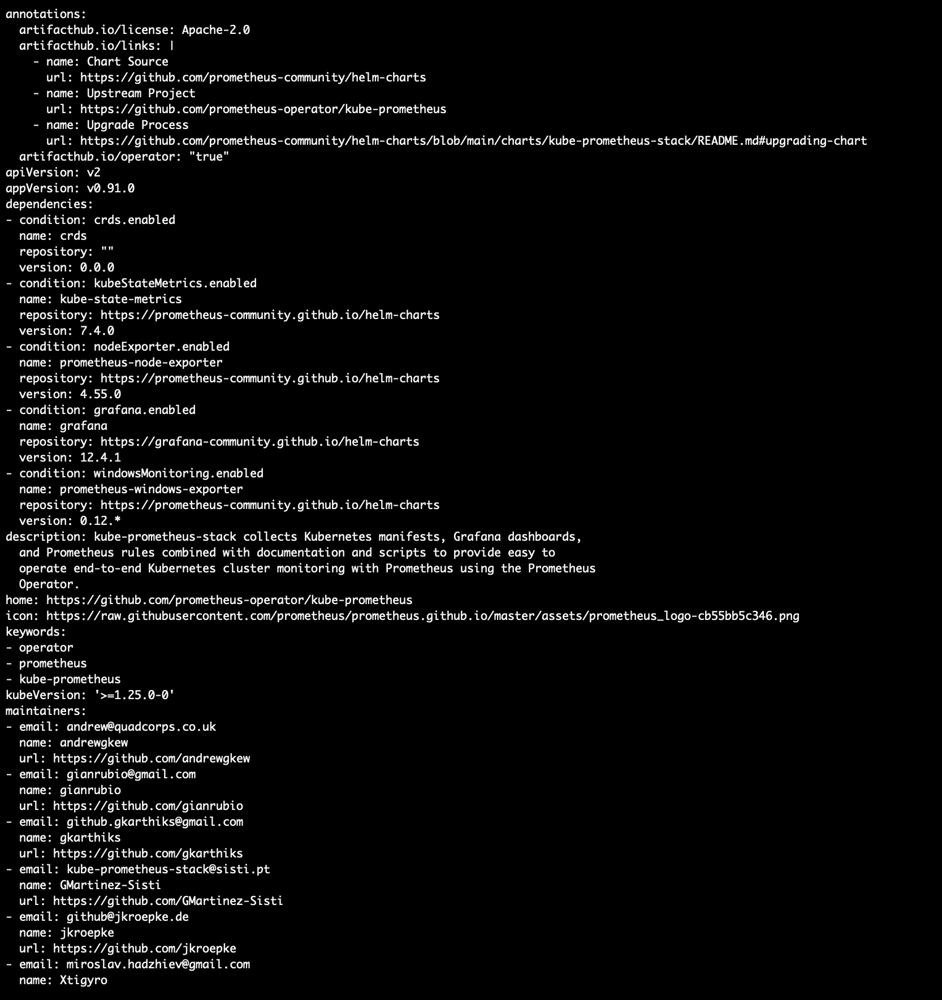

### Réflexion théorique - Dépendances et composition
> `kube-prometheus-stack` installe Prometheus, Grafana, Alertmanager et kube-state-metrics en une seule commande. Helm peut-il garantir que si l'installation de Grafana échoue, Prometheus est également annulé ?

Par défaut, non. Helm installe toutes les ressources d'une release, mais sans option particulière il ne garantit pas un rollback automatique complet si une partie de l'installation échoue. Il peut donc rester des ressources déjà créées, par exemple Prometheus, même si Grafana échoue ensuite.

Pour obtenir un comportement transactionnel, il faut demander explicitement à Helm de revenir en arrière en cas d'échec. Dans la version utilisée ici (`Helm v4.1.4`), l'option documentée est `--rollback-on-failure`. Elle provoque le rollback de l'upgrade, ou la désinstallation de la release lors d'un premier install raté. Elle active aussi l'attente des ressources via `--wait`.

Avec Helm 3, l'option équivalente généralement utilisée est `--atomic`, qui rollback automatiquement en cas d'échec et implique également `--wait`.

Source : documentation Helm, commandes `helm install` et `helm upgrade` : https://helm.sh/docs/helm/

> Comment adapterez vous vos prochaines commandes `helm upgrade --install` et `helm install` pour garantir ce comportement ?

J'ajouterai une option de rollback et un délai explicite :

```bash
helm upgrade --install monitoring \
  prometheus-community/kube-prometheus-stack \
  --namespace monitoring \
  --create-namespace \
  --set grafana.adminPassword=admin \
  --rollback-on-failure \
  --timeout 10m
```

Pour une commande `helm install`, le principe est le même :

```bash
helm install monitoring \
  prometheus-community/kube-prometheus-stack \
  --namespace monitoring \
  --create-namespace \
  --rollback-on-failure \
  --timeout 10m
```

Si l'environnement utilise Helm 3, je remplacerai `--rollback-on-failure` par :

```bash
--atomic --timeout 10m
```

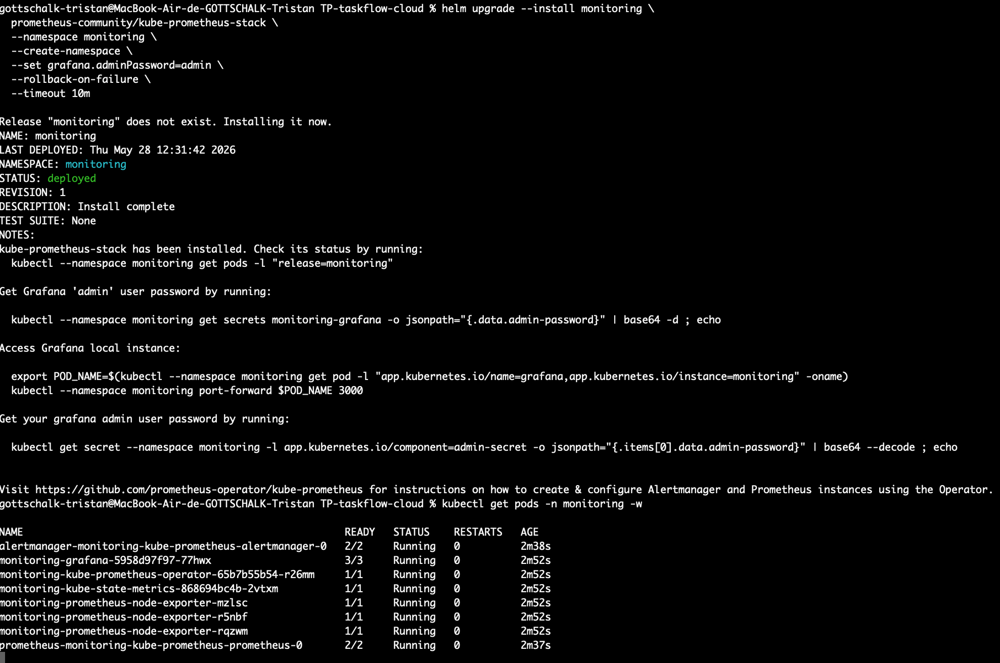


### Question - Nombre de fichiers écrits

> Combien de fichiers avez-vous écrits pour installer cette stack complète ? Comparez avec ce que vous avez fait en partie 1.

Avec le chart officiel `kube-prometheus-stack`, aucun manifeste Kubernetes n'a besoin d'être écrit pour installer la stack complète. Une commande Helm suffit, avec éventuellement quelques valeurs passées en ligne de commande.

En partie 1, il fallait maintenir plusieurs fichiers de configuration et manifests pour Prometheus, Grafana, Loki, Tempo, Promtail, les dashboards, les datasources, etc. Helm réduit donc fortement la quantité de YAML à écrire et à maintenir : on configure un chart existant au lieu de recréer toute la stack à la main.

### Réflexion théorique - Pourquoi port-forward pour Grafana ?

> Relisez votre `k8s/kind-config.yaml` et votre `k8s/base/ingress.yaml`. Quel mécanisme permet à TaskFlow d'être accessible sur le port 80 sans `port-forward` ?

TaskFlow est accessible sur `http://localhost` grâce à deux mécanismes combinés :

- le cluster kind expose le port `80` du conteneur control-plane vers le port `80` de la machine hôte via `extraPortMappings` dans `k8s/kind-config.yaml` ;
- un Ingress NGINX route ensuite les chemins `/` et `/api` vers les Services `frontend` et `api-gateway`, grâce aux ressources définies dans `k8s/base/ingress.yaml`.

Le flux est donc : navigateur local -> port 80 de la machine -> port 80 du cluster kind -> contrôleur Ingress NGINX -> Service Kubernetes TaskFlow.

> Pourquoi ce mécanisme ne fonctionne-t-il pas pour Grafana dans le namespace `monitoring` ?

Grafana est bien exposé dans Kubernetes par un Service, mais il n'a pas de règle Ingress équivalente dans le namespace `monitoring`. Le contrôleur Ingress ne sait donc pas router une URL publique vers le Service `monitoring-grafana`.

Le `port-forward` crée un tunnel temporaire directement entre la machine locale et le Service Grafana. C'est pour cela que Grafana devient disponible sur `localhost:3100`, même sans Ingress.

> Quelle modification faudrait-il apporter, sans toucher au code de `kube-prometheus-stack`, pour rendre Grafana accessible via une URL comme `http://localhost/grafana` ?

Il faudrait ajouter une ressource `Ingress` dans notre chart local ou dans nos manifests, qui route le chemin `/grafana` vers le Service `monitoring-grafana` du namespace `monitoring`.

Il faudrait aussi configurer Grafana pour servir correctement depuis un sous-chemin :

```yaml
grafana:
  grafana.ini:
    server:
      root_url: "http://localhost/grafana"
      serve_from_sub_path: true
```

Ainsi, on ne modifie pas le chart tiers lui-même : on surcharge ses valeurs et on ajoute une ressource Kubernetes autour de lui.

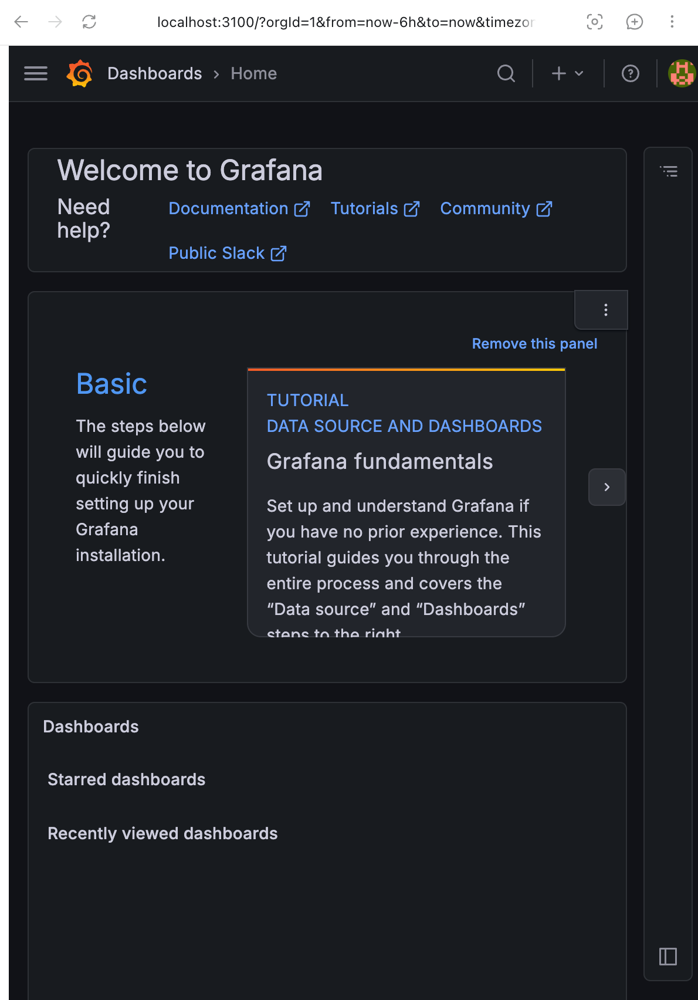

## Étape 2 - Intégrer ses dashboards customs

### Réflexion théorique - Surcharger les valeurs d'un chart tiers

> Pourquoi séparer les valeurs sensibles dans un fichier à part ? Comment passez-vous les deux fichiers à Helm en même temps ?

Les valeurs sensibles, comme les mots de passe Grafana ou les identifiants SMTP, ne doivent pas être versionnées dans Git. Les séparer dans un fichier dédié permet de garder un fichier de configuration principal partageable, par exemple `values.monitoring.yaml`, et un fichier local ignoré par Git, par exemple `values.monitoring.secret.yaml`.

On passe les deux fichiers à Helm avec plusieurs options `-f`. Helm les applique dans l'ordre, et le dernier fichier peut surcharger les valeurs précédentes :

```bash
helm upgrade --install monitoring ./helm/monitoring \
  --namespace monitoring \
  --create-namespace \
  -f helm/monitoring/values.monitoring.yaml \
  -f helm/monitoring/values.monitoring.secret.yaml
```

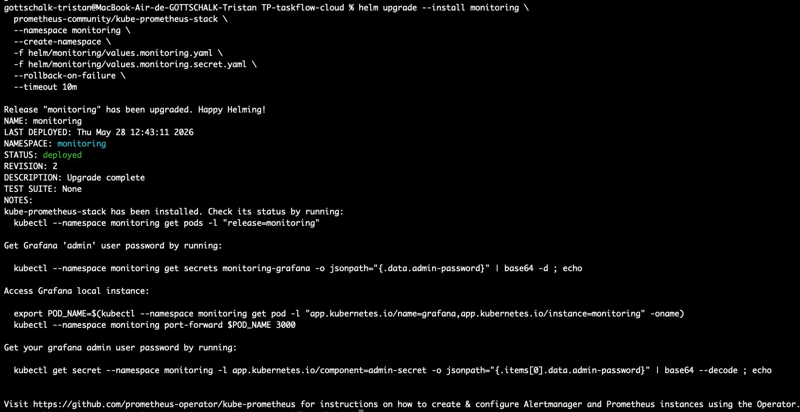

> Quelle différence y a-t-il entre passer `--values mon-fichier.yaml` et `--set grafana.adminPassword=admin` ? Dans quel cas préférez-vous l'un ou l'autre ?

`--values` ou `-f` charge un fichier YAML complet. C'est préférable pour une configuration structurée, lisible, réutilisable et versionnable. C'est le bon choix pour des dashboards, des réglages Prometheus, Alertmanager, Grafana, des ressources, des selectors, etc.

`--set` modifie une valeur directement depuis la ligne de commande. C'est pratique pour un test rapide, une valeur simple, ou une surcharge ponctuelle dans un script. En revanche, ce format devient vite peu lisible dès qu'il y a plusieurs valeurs imbriquées.

Je préfère donc :

- `-f values.yaml` pour la configuration durable ;
- `--set` pour une modification courte, temporaire ou expérimentale.

### Réflexion théorique - ConfigMap inline

> Donnez la commande utilisée et montrez la présence du dashboard dans Grafana.

Commande à lancer pour appliquer le ConfigMap inline fourni :

```bash
kubectl apply -f helm/monitoring/templates/dashboard-configmap.yaml
```

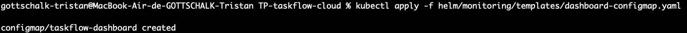

Après rechargement de Grafana, le dashboard doit apparaître automatiquement grâce au sidecar Grafana, car le ConfigMap porte le label :

```yaml
grafana_dashboard: "1"
```
Dashboard lists :

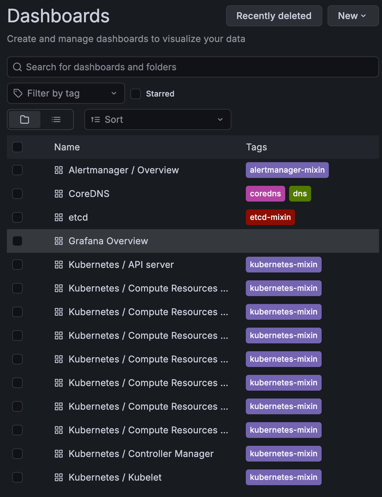

### Réflexion théorique - Limites du ConfigMap inline

> Pourquoi serait-il problématique de coller ce JSON directement dans le champ `data` du ConfigMap avec `|` ? Pensez à la maintenabilité, à la lisibilité, et au fait que vous avez plusieurs dashboards.

Coller directement un dashboard JSON complet dans un ConfigMap rend le template difficile à lire et à maintenir. Les dashboards Grafana sont longs, imbriqués, et changent souvent depuis l'interface Grafana. Si plusieurs dashboards sont collés dans le même template, le fichier devient très lourd et les diffs Git deviennent peu lisibles.

Cela pose aussi un problème d'organisation : chaque ajout de dashboard obligerait à modifier le template Helm lui-même, alors que le template devrait rester générique.

> Helm permet d'accéder aux fichiers du chart depuis un template via `.Files`. Quelle fonction permettrait de charger automatiquement tous les fichiers `*.json` d'un dossier en une seule déclaration, sans modifier le template à chaque ajout ?

La fonction utile est :

```gotemplate
.Files.Glob
```

Elle permet de sélectionner plusieurs fichiers du chart avec un motif, par exemple :

```gotemplate
{{ (.Files.Glob "dashboards/*.json").AsConfig }}
```

Source : documentation Helm, accéder aux fichiers depuis un template : https://helm.sh/docs/chart_template_guide/accessing_files/

> Proposez une implémentation du ConfigMap en utilisant cette fonction, permettant de lire vos dashboards sous le répertoire `helm/monitoring/dashboards/*.json`.

Implémentation proposée :

```yaml
apiVersion: v1
kind: ConfigMap
metadata:
  name: taskflow-dashboards
  namespace: monitoring
  labels:
    grafana_dashboard: "1"
data:
{{ (.Files.Glob "dashboards/*.json").AsConfig | indent 2 }}
```

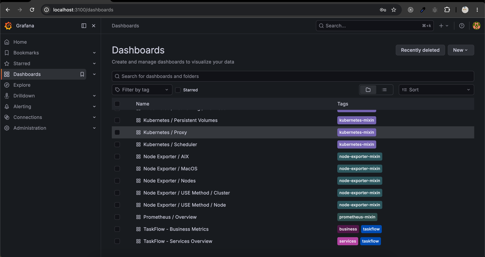

Avec cette approche, il suffit de copier un nouveau fichier JSON dans `helm/monitoring/dashboards/` pour qu'il soit intégré au ConfigMap au prochain rendu Helm. Le template n'a pas besoin d'être modifié.

## Étape 3 - Connecter TaskFlow à Prometheus

Les Services backend de TaskFlow ont été adaptés pour pouvoir être ciblés par des `ServiceMonitor`.
Chaque Service expose maintenant :

- un label `app` dans `metadata.labels`, utilisé par le selector du `ServiceMonitor` ;
- un port nommé `http`, utilisé par Prometheus pour savoir quel port scraper.

Le chart monitoring génère ensuite les quatre `ServiceMonitor` avec une boucle Helm `range`, pour éviter de dupliquer quatre fichiers presque identiques.

Réinstallation du chart TaskFlow après adaptation des Services :

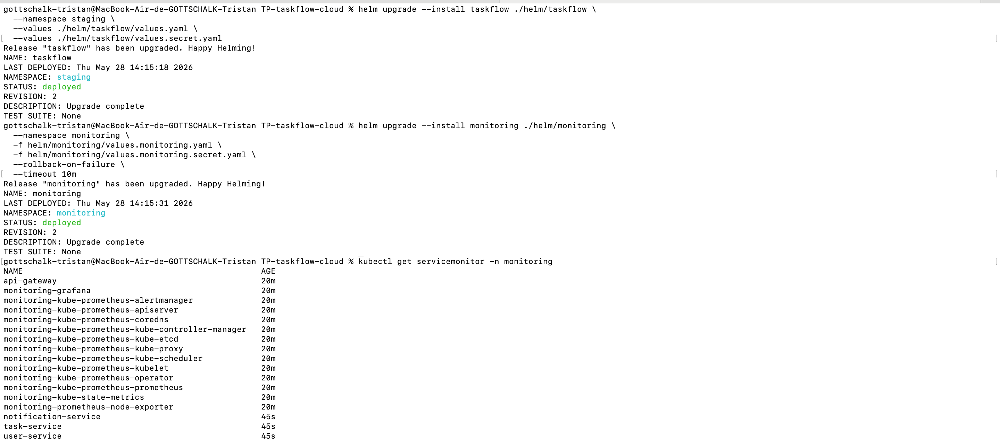

Prometheus est maintenant autorisé à découvrir les `ServiceMonitor` hors de son namespace grâce à :

```yaml
serviceMonitorNamespaceSelector: {}
serviceMonitorSelector:
  matchLabels:
    release: monitoring
```

Dans l'interface Prometheus, les targets TaskFlow apparaissent bien dans la page `/targets`.
Cela confirme que Prometheus scrape les métriques des services applicatifs.

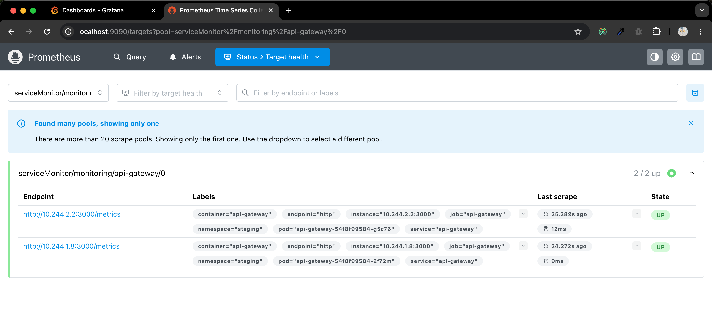

## Étape 4 - Configurer une alerte

### Règle `HighP95Latency`

La règle doit calculer le P95 de la durée des requêtes HTTP du `task-service`. Comme la métrique est un histogramme, il faut utiliser les buckets `http_request_duration_ms_bucket`, calculer un `rate()` sur une fenêtre temporelle, puis agréger par bucket `le` avant d'appliquer `histogram_quantile()`.

Expression PromQL proposée :

```promql
histogram_quantile(
  0.95,
  sum by (le) (
    rate(http_request_duration_ms_bucket{job="task-service", route!="/metrics"}[1m])
  )
) > 500
```

Structure d'alerte proposée :

```yaml
- alert: HighP95Latency
  expr: histogram_quantile(0.95, sum by (le) (rate(http_request_duration_ms_bucket{job="task-service", route!="/metrics"}[1m]))) > 500
  for: 30s
  labels:
    severity: warning
  annotations:
    summary: "Latence P95 élevée sur task-service"
    description: "La latence P95 du task-service dépasse 500 ms depuis au moins 30 secondes."
```

L'agrégation `sum by (le)` est importante : si on garde les labels `route`, `method` ou `status`, `histogram_quantile()` calcule des quantiles séparés par série et le résultat global du service peut être faux.

Sources :

- Prometheus `histogram_quantile()` et `rate()` : https://prometheus.io/docs/prometheus/latest/querying/functions/#histogram_quantile
- Règles d'alerting Prometheus : https://prometheus.io/docs/prometheus/latest/configuration/alerting_rules/

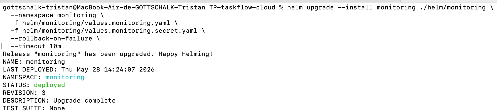

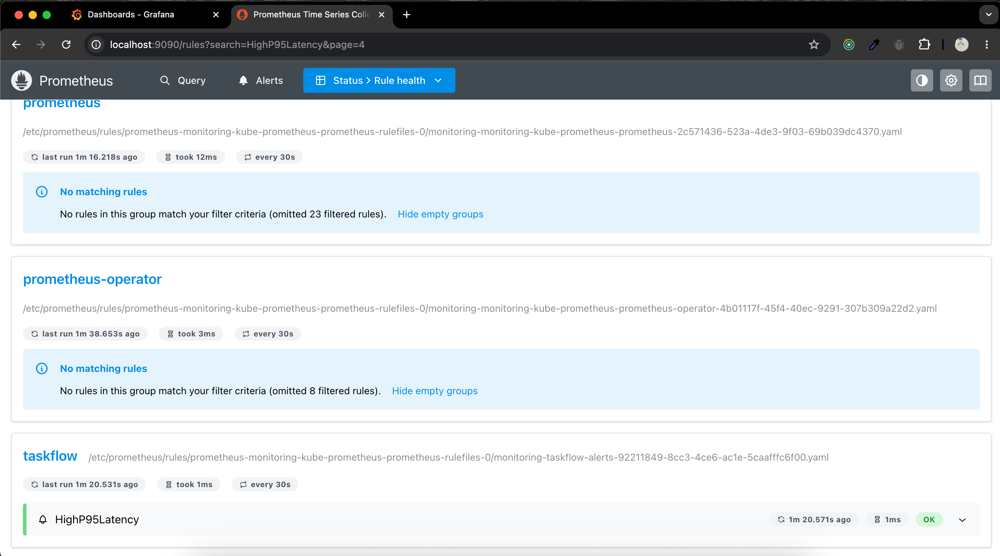

## Étape 5 - Notifier via Alertmanager

### Observations Alertmanager

À compléter après manipulation :

- Alerte `HighP95Latency` visible dans Prometheus : à compléter.
- Alerte visible dans Alertmanager : à compléter.
- Email reçu via Brevo : à compléter.
- Logs observés (`Notify success` ou erreur SMTP) : à compléter.

Les timings à garder en tête :

- `for: 30s` : Prometheus attend 30 secondes de condition vraie avant de passer l'alerte en `firing`.
- `group_wait` : Alertmanager attend avant d'envoyer la première notification.
- `group_interval` : Alertmanager espace les notifications si le groupe d'alertes évolue.

Si le pic de latence est plus court que `for + group_wait`, il est possible de voir uniquement une résolution ou de rater la notification de déclenchement.

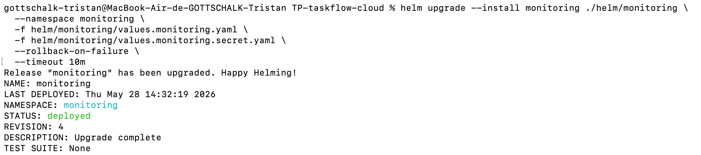

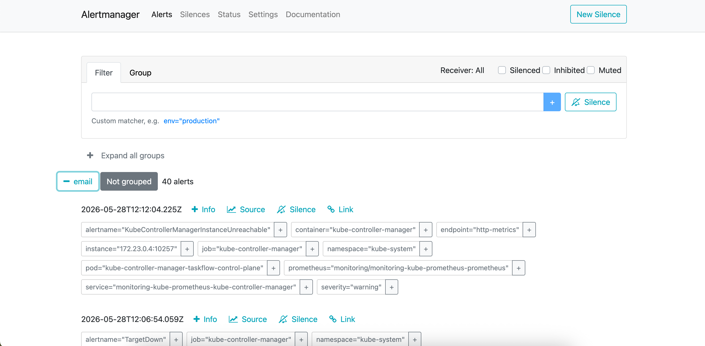

## Étape 6 - Auto-scaling avec le HPA

### Réflexion théorique - Observer et comprendre le scaling

> Regardez vos dashboards Grafana pendant le test. Quels services montrent une augmentation de latence ou d'erreurs sous charge ? Est-ce cohérent avec l'architecture de TaskFlow ?

Le test de charge n'a pas été exploitable pour conclure proprement : le port-forward utilisé comme point d'entrée a été interrompu pendant l'exécution. Les résultats k6 ne reflètent donc pas uniquement le comportement applicatif ou le HPA, mais aussi une coupure de connectivité locale.

Attendu probable : `api-gateway` et `task-service` devraient montrer les hausses les plus visibles, car le trafic utilisateur passe par l'API Gateway et les opérations métier de tâches sollicitent directement le `task-service`. Si les endpoints touchent l'authentification, `user-service` peut aussi être impacté. `notification-service` dépend davantage du flux asynchrone Redis et peut être moins directement sensible au trafic HTTP utilisateur.

Cette observation est cohérente avec l'architecture : le point d'entrée (`api-gateway`) et le service métier central (`task-service`) concentrent la charge synchrone.

> TaskFlow est composé de plusieurs services : `api-gateway`, `task-service`, `user-service`, `notification-service`, `postgres`, `redis`. Lesquels ont du sens à scaler horizontalement, et lesquels ne le peuvent pas ou ne le devraient pas ? Justifiez pour chaque service en vous appuyant sur vos observations.

Services qui ont du sens à scaler horizontalement :

- `api-gateway` : stateless, reçoit le trafic entrant, peut distribuer la charge sur plusieurs pods.
- `task-service` : stateless côté application, bon candidat au scaling si la charge vient des requêtes de gestion des tâches.
- `user-service` : stateless côté application, peut scaler si l'authentification ou la gestion des utilisateurs devient un point chaud.
- `notification-service` : peut scaler si plusieurs workers peuvent consommer les messages Redis sans doublons problématiques. Il faut vérifier la logique de consommation pour éviter les traitements concurrents indésirables.

Services à traiter avec prudence :

- `postgres` : base de données stateful. Le scaling horizontal n'est pas simple et demande une architecture dédiée : réplication, leader/follower, sharding, opérateur PostgreSQL, gestion des écritures.
- `redis` : stateful également. Le scaling horizontal demande Redis Cluster, Sentinel ou une configuration maintenue par un chart/opérateur adapté. Ajouter plusieurs pods indépendants ne suffit pas.

> Le HPA a-t-il amélioré les résultats par rapport à un déploiement sans HPA ? Comparez les métriques (latence p95, taux d'erreurs). Si le résultat vous surprend, expliquez pourquoi.

Impossible de conclure de façon fiable avec ce test, car l'interruption du port-forward a faussé les métriques. Dans ces conditions, un taux d'erreur élevé peut venir du point d'accès local et non d'une saturation réelle de `task-service`.

Sur kind, il ne serait pas surprenant que le HPA améliore peu les résultats, voire les dégrade. Les pods supplémentaires partagent les mêmes ressources physiques de la machine locale. Si le nœud est déjà limité en CPU ou mémoire, ajouter des replicas augmente la contention au lieu d'ajouter de la capacité réelle.

Métriques à comparer :

- latence p95 avant/après HPA ;
- taux d'erreurs HTTP avant/après HPA ;
- nombre de pods `task-service` ;
- CPU disponible sur le ou les nœuds.

> Le HPA scale les pods, mais si le nœud sous-jacent n'a plus de ressources disponibles, que se passe-t-il ? Quel mécanisme Kubernetes permet de scaler les nœuds eux-mêmes ? Pourrait-il résoudre le problème observé sur kind ?

Si le nœud n'a plus assez de ressources, Kubernetes peut créer de nouveaux pods demandés par le HPA, mais le scheduler ne pourra pas forcément les placer. Les pods peuvent rester en état `Pending`, ou bien être placés mais subir une forte contention CPU/mémoire.

Le mécanisme qui scale les nœuds eux-mêmes est un autoscaler de cluster, par exemple :

- Cluster Autoscaler ;
- Karpenter, surtout dans des environnements cloud comme AWS.

Sur kind, cela ne résout pas réellement le problème : le cluster tourne dans des conteneurs locaux sur la même machine. Il n'y a pas de vraie capacité cloud élastique à ajouter automatiquement. Le Cluster Autoscaler ou Karpenter ont surtout du sens sur un fournisseur cloud capable de créer de nouvelles machines.

### Réflexion théorique - Choisir la bonne métrique de scaling

> Nous avons configuré le HPA sur le CPU. Est-ce la métrique la plus pertinente pour un service HTTP ? Donnez un exemple de situation où le CPU est bas mais les utilisateurs subissent une dégradation.

Le CPU est utile, mais ce n'est pas toujours la métrique la plus pertinente pour un service HTTP. Un service peut avoir un CPU bas tout en étant lent si le problème vient d'une dépendance externe ou d'une attente I/O.

Exemples :

- requêtes bloquées en attente de PostgreSQL ;
- pool de connexions saturé ;
- Redis lent ou indisponible ;
- appels réseau vers un autre service qui répond lentement ;
- files d'attente internes qui grossissent.

Dans ces cas, les utilisateurs subissent une latence élevée alors que le CPU de l'application reste modéré.

> Le HPA `autoscaling/v2` permet de combiner plusieurs métriques, il scale dès que l'une d'elles dépasse son seuil. Avec quelles autres métriques déjà exposées avec Prometheus combineriez-vous le HPA et quel seuil paramétreriez-vous ?

Je combinerais le CPU avec une métrique de latence HTTP, par exemple la latence P95 du `task-service` :

```promql
histogram_quantile(
  0.95,
  sum by (le) (
    rate(http_request_duration_ms_bucket{job="task-service", route!="/metrics"}[1m])
  )
)
```

Un seuil cohérent avec l'alerte du TP serait `500 ms`. Si le P95 dépasse 500 ms, cela indique que 5 % des requêtes les plus lentes dépassent déjà une limite utilisateur acceptable.

On pourrait aussi utiliser le taux de requêtes HTTP si l'objectif est d'anticiper la saturation avant que la latence ne monte, par exemple scaler quand le nombre de requêtes par seconde dépasse une valeur observée comme limite stable dans Grafana. Le seuil exact doit être calibré avec les résultats du test k6.

> Cette configuration ne fonctionnerait pas directement sur votre cluster. Quel composant manque-t-il, et pourquoi ?

Le HPA Kubernetes sait lire nativement les métriques CPU/mémoire via le Metrics Server. En revanche, il ne sait pas lire directement les métriques Prometheus applicatives.

Pour scaler sur une métrique Prometheus comme la latence P95, il manque un adaptateur de métriques, par exemple :

- Prometheus Adapter pour exposer des métriques custom via l'API Kubernetes ;
- ou KEDA, qui peut scaler sur des métriques externes et Prometheus.

Sans ce composant, le HPA ne peut pas utiliser directement `http_request_duration_ms_bucket`.

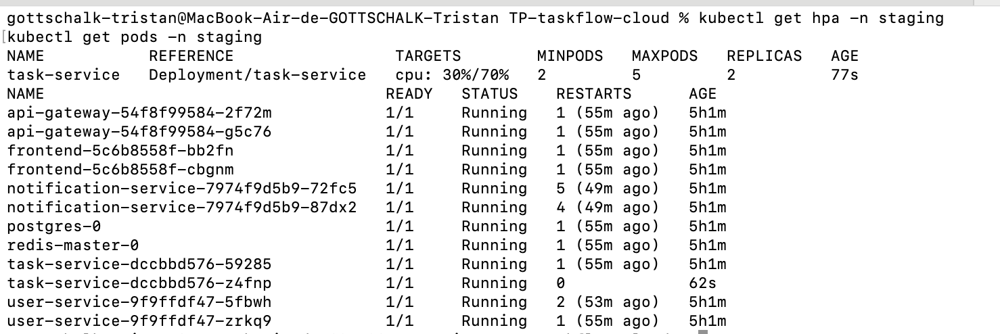

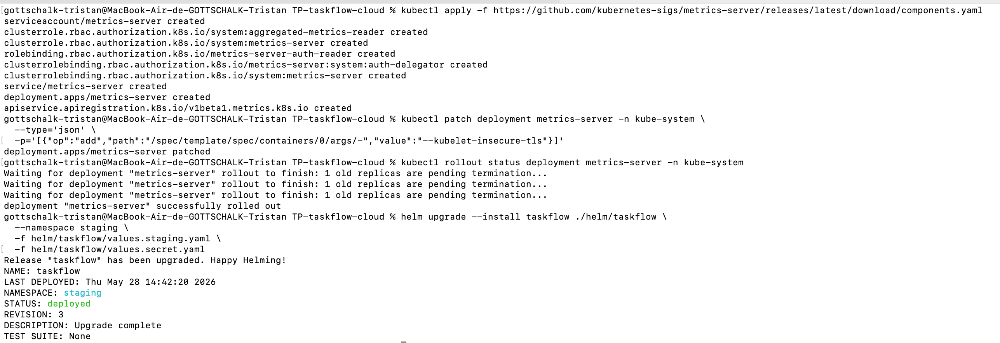

## Étape 7 - Haute disponibilité et résilience

### Réflexion théorique - Élasticité vs haute disponibilité

> Quelle différence faites-vous entre élasticité et haute disponibilité ? Le HPA contribue-t-il aux deux ?

L'élasticité consiste à ajuster automatiquement la capacité en fonction de la charge, par exemple augmenter ou réduire le nombre de pods avec un HPA.

La haute disponibilité consiste à maintenir le service disponible malgré une panne, par exemple grâce à plusieurs replicas répartis sur plusieurs nœuds, des probes correctes, un load balancing et une stratégie de redémarrage.

Le HPA contribue surtout à l'élasticité. Il peut aider indirectement la disponibilité en créant plus de pods, mais il ne suffit pas à garantir la haute disponibilité. Si tous les pods tournent sur le même nœud, une panne de ce nœud peut toujours interrompre le service.

> Avec `replicaCount: 2` sur `api-gateway`, que se passe-t-il si un pod crashe ? Comparez avec `replicaCount: 1`.

Avec `replicaCount: 2`, si un pod `api-gateway` crashe, l'autre pod peut continuer à servir du trafic pendant que Kubernetes recrée le pod manquant. L'impact utilisateur peut être nul ou limité, selon la qualité des probes et du routage.

Avec `replicaCount: 1`, si le seul pod crashe, il n'y a plus d'instance disponible pendant le redémarrage. Le service peut donc devenir temporairement indisponible.

> Kubernetes garantit que le nombre de replicas souhaité est toujours maintenu. Quel composant est responsable de cette réconciliation ?

Le composant responsable est le controller manager, plus précisément le Deployment Controller et le ReplicaSet Controller. Ils comparent en continu l'état désiré, par exemple `replicas: 2`, avec l'état réel du cluster. Si un pod disparaît, ils déclenchent la création d'un nouveau pod pour revenir à l'état attendu.

> Votre déploiement actuel en staging garantit-il la haute disponibilité ? Quelles conditions doivent être réunies pour la garantir en production ?

Le staging améliore la résilience avec `replicaCount: 2` sur plusieurs services, mais il ne garantit pas complètement la haute disponibilité.

Pour garantir la haute disponibilité en production, il faudrait notamment :

- plusieurs replicas pour les services stateless ;
- une répartition des pods sur plusieurs nœuds avec anti-affinity ou topology spread constraints ;
- des probes `readiness` et `liveness` fiables ;
- suffisamment de ressources disponibles pour replacer les pods après une panne ;
- une base PostgreSQL hautement disponible, pas un simple pod unique ;
- une stratégie Redis adaptée si Redis devient critique ;
- un Ingress/load balancer redondant ;
- idéalement plusieurs zones de disponibilité côté cloud.

La haute disponibilité ne dépend donc pas seulement du nombre de replicas applicatifs. Elle dépend aussi de l'infrastructure sous-jacente, des dépendances stateful et de la répartition réelle des pods.

Résultats finaux après tests k6 et simulation de perte d'un service : 
